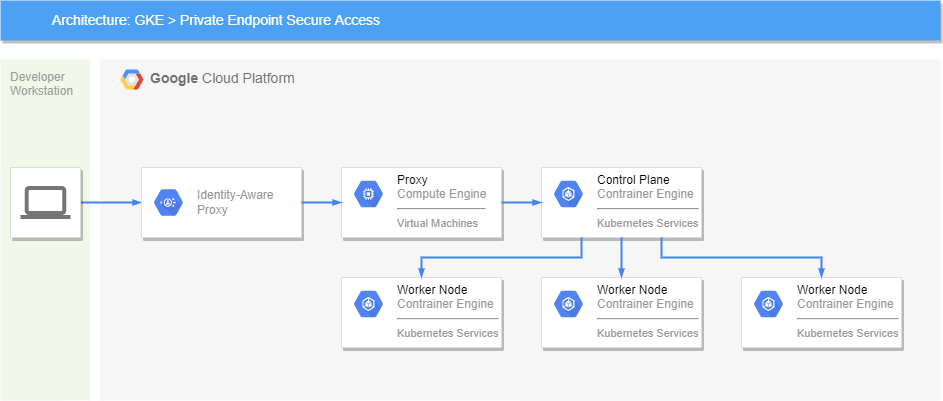

# terragrunt-gcp-gke-private

## Overview
This example deploys an opinionated GKE Private cluster and demonstrates how to connect to the GKE Private Endpoint using IAP tunneling.



The following resources are deployed:

- Cloud NAT
- Cloud Router
- Google Cloud Storage
- GKE Cluster
- Proxy GCE VM
- VPC

Preemptible VMs are deployed to reduce costs.

The Terraform IaC leverages the Google Terraform registry modules and uses Terragrunt to orchestrate the deployment.

No public IP addresses are assigned to the Proxy VM and identity aware proxy provides a secure connection. 

## Pre-Requisites
### Development Environment
Google Cloud Shell is the preferred development environment for deploying this example.

The following tools are required:
- Bash Shell
- Google Cloud SDK v3.30.0+
- Jq
- Kubectl
- Terraform v1.1.0+
- Terragrunt v0.30.0+
- TFsec

All the tools above a pre-installed with Google Cloud Shell, except Terraform, Terragrunt and TFsec.

### IAM
A GCP project with the following permissions are required:

- roles/compute.admin
- roles/container.admin
- roles/iam.serviceAccountAdmin
- roles/iam.serviceAccountUser
- roles/iap.tunnelResourceAccessor 
- roles/resourcemanager.projectIamAdmin
- roles/serviceusage.serviceUsageAdmin
- roles/storage.admin

Create terraform service account with the permissions as follows:
```bash
export PROJECT_ID=
export PROJECT_NUMBER=
gcloud iam service-accounts create terraform --description="Terraform Service Account" --display-name="terraform"
gcloud projects add-iam-policy-binding $PROJECT_ID --member="serviceAccount:terraform@$PROJECT_ID.iam.gserviceaccount.com" --role="roles/compute.admin"
gcloud projects add-iam-policy-binding $PROJECT_ID --member="serviceAccount:terraform@$PROJECT_ID.iam.gserviceaccount.com" --role="roles/container.admin"
gcloud projects add-iam-policy-binding $PROJECT_ID --member="serviceAccount:terraform@$PROJECT_ID.iam.gserviceaccount.com" --role="roles/iam.serviceAccountAdmin"
gcloud projects add-iam-policy-binding $PROJECT_ID --member="serviceAccount:terraform@$PROJECT_ID.iam.gserviceaccount.com" --role="roles/iam.serviceAccountUser"
gcloud projects add-iam-policy-binding $PROJECT_ID --member="serviceAccount:terraform@$PROJECT_ID.iam.gserviceaccount.com" --role="roles/iap.tunnelResourceAccessor"
gcloud projects add-iam-policy-binding $PROJECT_ID --member="serviceAccount:terraform@$PROJECT_ID.iam.gserviceaccount.com" --role="roles/resourcemanager.projectIamAdmin"
gcloud projects add-iam-policy-binding $PROJECT_ID --member="serviceAccount:terraform@$PROJECT_ID.iam.gserviceaccount.com" --role="roles/serviceusage.serviceUsageAdmin"
gcloud projects add-iam-policy-binding $PROJECT_ID --member="serviceAccount:terraform@$PROJECT_ID.iam.gserviceaccount.com" --role="roles/storage.admin"

gcloud projects add-iam-policy-binding $PROJECT_ID --member="serviceAccount:$PROJECT_NUMBER@cloudbuild.gserviceaccount.com" --role="roles/iam.serviceAccountUser"
gcloud iam service-accounts add-iam-policy-binding terraform@$PROJECT_ID.iam.gserviceaccount.com --member="serviceAccount:$PROJECT_NUMBER@cloudbuild.gserviceaccount.com" --role="roles/iam.serviceAccountTokenCreator"
```

Enable google services needed to bootstrap and run a plan:
```bash
gcloud services enable cloudbuild.googleapis.com
gcloud services enable cloudresourcemanager.googleapis.com
gcloud services enable compute.googleapis.com
gcloud services enable container.googleapis.com
gcloud services enable iamcredentials.googleapis.com
```

In order to run the deployment, Google authentication needs to be setup unless using Google Cloud Shell.

If a service account is being used, set the environment `GOOGLE_APPLICATION_CREDENTIALS` as follows:
```bash
export GOOGLE_APPLICATION_CREDENTIALS=/path-to-credentials.json
gcloud auth activate-service-account --key-file=$GOOGLE_APPLICATION_CREDENTIALS
````

If a user account is being used, execute the following:
```bash
gcloud auth login
gcloud auth application-default login
````

## Setup
Create the file resources/common_vars.json as follows:
```json
{
  "project_id": "_project_",
  "region": "_region_"
}
```
### Optional Local Setup 
The command `sudo make setup` will download and install terraform, terragrunt and tfsec.

### Optional Docker / Podman Setup
A container image containing all the tools pre-installed for local development can be created by cloning the repository https://github.com/nhsy/gcp-devops.

Please ensure either Docker or Podman is pre-installed and execute one of the following to build the container locally.

For docker:
```bash
git clone https://github.com/nhsy/gcp-devops.git
cd gcp-devops
make build
```
For podman:
```bash
git clone https://github.com/nhsy/gcp-devops.git
cd gcp-devops
make podman-build
```

To launch the container image and bind mount the current directory execute the following from the root directory of this repository.

For docker:
```bash
./scripts/docker-start.sh
```
For podman:
```bash
./scripts/podman-start.sh
```

## Usage
### Deployment
Setup the environment variables:
```bash
source ./scripts/env.sh
```

For a quick deployment execute:
```bash

make all
make tunnel
```

For a step by step deployment execute to troubleshoot any errors:
```bash
make init
make validate
make plan
make apply
make tunnel
```

### Destroy
To delete everything created execute:
```bash
make destroy
```

## Additional Info
### Private GKE Control Plane Endpoint Access
kubectl commands need to be prefixed with `HTTPS_PROXY=localhost:8080` as follows: 
```bash
HTTPS_PROXY=localhost:8080 kubectl get all
```

Setting the bash alias below is useful:
```bash
alias kp='HTTPS_PROXY=localhost:8080 kubectl $*'

kp get all
```

### Customisations

The common_vars.json file can be customised as follows:
```json
{
  "project_id": "_project_",
  "region": "europe-west1",

  "preemptible": "true",
 
  "gke_nodes_min": 3,
  "gke_nodes_max": 10,
  "gke_regional": false,

  "skip_proxy": false,
  "skip_gke": false
}
```

## Known issues
* If you set the environment variable `export HTTPS_PROXY=localhost:8080`, remember to unset prior to destroying!
